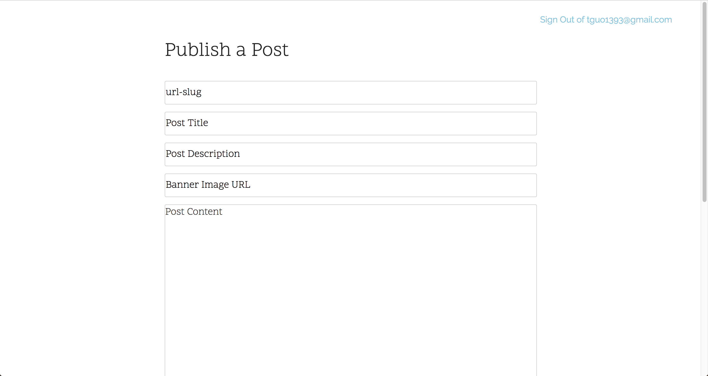

# Blogg
Blogg is a simple open-source blogging platform designed for developers. You get to own the code, hosting, and domain name while skipping the hassle of config, boilerplate, and setup. Download the code and get a blog running from your own personal domain in less than an hour! To see what the blog looks like, head over to mine: [tommyguo.me](https://tommyguo.me).

Blogg provides just the basic blogging functionalities. Because you own the code, you can (and are encouraged to) modify and add new features to your blog. I think that Blogg can be helpful whether you want a simple website to jot down your thoughts or a professional blog that's filled with features.

# Prerequisite Knowledge
Although Blogg is designed to be simple, here are things you should know or learn before using it:
* familiarity with the command line
* git
* HTML, CSS, and JavaScript: [developer.mozilla.org/en-US/docs/Learn](https://developer.mozilla.org/en-US/docs/Learn)
* basic React: [reactjs.org/docs/hello-world.html](https://reactjs.org/docs/hello-world.html)
* basic familiarity with Express or similar web app framework: [www.npmjs.com/package/express](https://www.npmjs.com/package/express)
* basic SQL

And here are some things that you might learn by implementing Blogg:
* how to structure a web app
* good development practices
* more advanced HTML, CSS, JavaScript, Node.js, and React
* React Router
* Webpack
* SQL and Sequelize
* environment variables
* responsive web design
* authentication
* HTTPS
* cloud computing

# Technologies
Blogg is written in JavaScript on the front-end and back-end. It's a single page application that uses React on the front-end (and Webpack + Babel to prepare the React files). Front-end routing is handled with React Router while back-end routing for features such as HTTPS and API calls to the database are handled with Express. Blogg uses Sequelize as its ORM and PostgreSQL as its database. Blog posts are written in Markdown and converted to HTML using Remarkable. Authentication is done using Google Sign-In.

# Get Started
If you're stuck at any point, feel free to email me at `tguo1393@gmail.com`.

### Download the latest versions of node and npm:
[nodejs.org/en/](https://nodejs.org/en/)

### Set up your cloud-hosted virtual machine (VM) instance:
Your web server will run on this virtual machine. I'm using Google Cloud Platform for this tutorial. Sign up for $300 worth of GCP credit at [cloud.google.com/free/](https://cloud.google.com/free/). Go to [console.cloud.google.com](https://console.cloud.google.com) and log in. Click "Select a project" and then "New Project". Name it whatever you want.  

On the left sidebar, select "Compute Engine", and then select "VM instances". On the instances page, click "Create Instance". Name your instance anything you wish, change Machine type to f1-micro (to save money since you can always increase resources later), and check "Allow HTTP traffic" and "Allow HTTPS traffic".

Now that your VM instance has been created, select "VPC network" on the left sidebar, and then select "External IP addresses". Click "Reserve Static Address", give your IP address a name, and click "Reserve". Afterwards, click "Change", and select the name of the VM instance you just created. Take note of the "External Address" of the IP address you reserved: that's now the IP address of your VM.

### Set up your cloud-hosted DB instance:
Blogg stores posts in a database so that you don't have to manually edit code everytime you want to publish something to your blog. On the left sidebar, select "SQL", then "Create Instance", and then "PostgreSQL". Choose an Instance ID and a secure password. Now under your instance details, click "Add network" to authorize an IP address to access your DB instance. You'll want to add any IP address that you'll be developing from (e.g. coffee shop or home IP address) as well as the IP address of your VM from the previous section. Google "what's my IP address" to find your IP address.

# Set Up Your Dev Environment
Follow these steps on the computer you use to code (so not the VM).

### Download the code:
    git clone https://github.com/tommyguo/blogg.git

### Install dependencies:
    cd blogg && npm install
    
### Set up your .env file:
Blogg uses [dotenv](https://www.npmjs.com/package/dotenv) to handle environment variables.
These env variables tell the web app how to connect to the database, set up Google Sign-In, and find our SSL certificates.
Create a file called `.env` under the root directory, `blogg`:

    touch .env

Open up `.env` in a code editor and enter in the following with appropriate values (you should only need to change the values for `DB_HOST` and `DB_PASS`):

    DB_HOST=123.123.123
    DB_USER=postgres
    DB_PASS=L8sdkuj12!!
    DB_NAME=postgres
    DB_DIALECT=postgres

Warning: the `.env` file should NEVER be shared publicly (e.g. pushed to Github).

### Set up Google Sign-In
Blogg uses Google Sign-In to prevent unauthorized users from publishing posts to your blog.
Follow the "Before you begin" part of this tutorial to grab your Client ID [developers.google.com/identity/sign-in/web/sign-in](https://developers.google.com/identity/sign-in/web/sign-in). Add `http:localhost:8080` and your domain name (if you don't have one now, you can always add it later) under "Authorized JavaScript origins":

Add the following to your `.env` file with your client ID instead of the placeholder one:

    GOOGLE_CLIENT_ID=12839712938719-1aaf0e6vhjn35169mifho851506obeql.apps.googleusercontent.com

Finally in `blogg/src/config/config.js`, replace the following with Gmail accounts that you want to have publishing access:

    VALID_EMAILS: ['tguo1393@gmail.com']

### Build and run the web app in dev mode:
    npm run buildDev && npm start

Your dev environment is now ready!

### Open up your browser:
Check out the main page at `http://localhost:8080`, which shows previews of your blog posts. Since you don't have any blog posts yet, you should only see the side bar. Check out the publishing page at `http://localhost:8080/publish`. You should see the following after you sign in if Google Sign-In was set up correctly:

### Make the blog yours:
Now that your dev environment is ready, you can go ahead and modify the blog. In `blogg/src/html/index.html`, change the title of the website. In `blogg/src/react/components`, add your personal details to `NameBar.js`, `SideBar.js`, and `AuthorTag.js`. Because the dev environment supports Hot Module Replacement, you should see these updates when you visit `http://localhost:8080` without rebuilding the web app or restarting the server. In `blogg/src/images`, replace `prof_pic.png` with a picture of yourself! Since this isn't a component, you will have to rebuild the web app and restart the server to see the changes. Simply terminate the script and rerun:

    npm run buildDev && npm start

# Set Up Your Prod Environment
Now it's time to get this running on your VM so that your blog will be accessible 24/7 on a publicly accessible IP address.

### Transfer files to your VM:

You'll need to transfer all the code in `blogg` over to your VM. There are a couple of ways to do this. You could push your code to Github and then download the code on your VM. If you do this, remember to rerun `npm install` as well as transfer over your `.env` file, which won't be tracked by git. Other options are listed in [cloud.google.com/compute/docs/instances/transfer-files](https://cloud.google.com/compute/docs/instances/transfer-files).

### Build the web app in prod mode:
Once you've transferred all the code to your VM, head over to `blogg` on your VM and run:

    npm run buildProd

### Run the web app:
Now that it's finished building, you can run the server code:

    sudo npm start

We need to use `sudo` in order to bind to port 80.

### Open up your web browser:

Visit your website at `http://[VM_IP_Address]`. Once you get a domain name and link it to your VM's IP Address, you'll be able to go directly to `http://[Your_Domain_Name]`.

### Make your web server run forever:

[forever](https://www.npmjs.com/package/forever) ensures that your web server is always up and running. Terminate your current `sudo npm start` script. Then run:

    sudo npm install forever -g

    sudo forever start ./dist/server.js && forever start ./dist/apiServer.js

Head over to `http://[VM_IP_Address]` to make sure that your web server is running.

To monitor your forever processes, run:

    forever list

To stop a process, run:

    forever stop [process id]

Congratulations! You've set up your own blog.

# Start Publishing Posts
Now you're ready to publish a post. Simply head over to `/publish`, log in with the Gmail account that you have granted publishing access, and fill out the fields. The `url-slug` field is the URL you want to be able to access your post at: `/post/[url-slug]`. The `Post Content` field accepts Markdown and converts it into HTML, which is previewed below. Here's a helpful cheat sheet for Markdown: [github.com/adam-p/markdown-here/wiki/Markdown-Cheatsheet](https://github.com/adam-p/markdown-here/wiki/Markdown-Cheatsheet). After you publish a post, it will automatically show up on the main page.

If you ever need to manually interact with the database, for example to edit or delete a post, I recommend [pgAdmin](https://www.pgadmin.org/download/). 

# Optional Set Up
### Get a domain name:
You can follow this tutorial: [cloud.google.com/dns/docs/quickstart](https://cloud.google.com/dns/docs/quickstart).
If you're a student, check out how to get a domain name for free from Namecheap via Github: [education.github.com/pack](https://education.github.com/pack)

### Set up HTTPS:
Follow this tutorial: [certbot.eff.org/lets-encrypt/debianstretch-other](https://certbot.eff.org/lets-encrypt/debianstretch-other), running all of this on your VM. Afterwards, uncomment HTTPS code in `blogg/src/server/prodServ.js` and add the following to your `.env` file (the path to the certs on your VM) with your values:

    PRIV_KEY_PATH=/etc/letsencrypt/live/tommyguo.me/privkey.pem
    CERT_PATH=/etc/letsencrypt/live/tommyguo.me/cert.pem

# Start Developing
Blogg is designed for you to continue developing and adding new features to your blog. The following are resources to help guide you:

## Code Breakdown
On the top level of the directory, Blogg has some config files such as `.babelrc` and `.eslintrc.js`. The `src` directory contains our code. Here's a summary the `src` directory:

* `config`: config files (mostly Webpack) tell us how to bundle our code. Our bundled code ends up in `blogg/dist` after we run the build script.
* `css`: css for our front-end!
* `db`: contains our ORM code and DB models. Blogg has two models, `Post` and `Image`, and `index.js` sets up and exports our models.
* `files`: files in this folder end up in `blogg/dist` where they are served by accessing `/file_name` in the browser via `express.static` middleware.
* `html`: because we're running a SPA, there's only one HTML file, which our React code attaches to.
* `images`: like files, these images end up in `blogg/dist` and can be accessed by `/image_name`.
* `react`: this has all of our front-end React code. `components` contains reusable components across web pages. `pages` contains specific pages, which are built from components. `AppRouter.js` handles front-end routing with React Router and `index.js` renders everything.
* `server`: our back-end server code. `apiServer.js` handles API calls to interact with our DB. `devServer.js` handles our main server in dev mode. The differences between dev mode and prod mode are that dev mode supports Hot Module Replacement while prod mode supports HTTPS.

## Feature Ideas
Here are a list of features that you can implement on top of Blogg:
* Allow readers to add comments.
* Include a Table of Contents as you browse a blog post.
* Add an email subscription button to your blog.
* Implement editing published posts.
* Implement load balancing and scaling: [cloud.google.com/compute/docs/load-balancing-and-autoscaling](https://cloud.google.com/compute/docs/load-balancing-and-autoscaling).